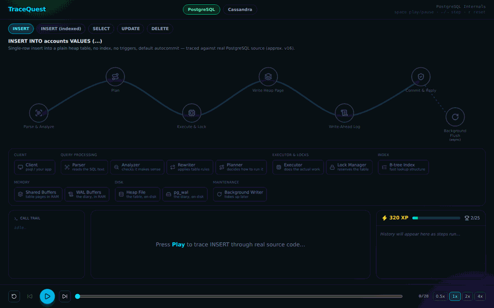
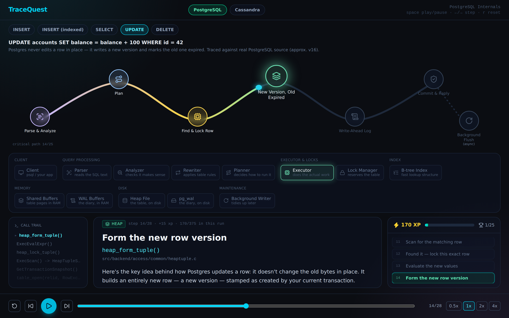
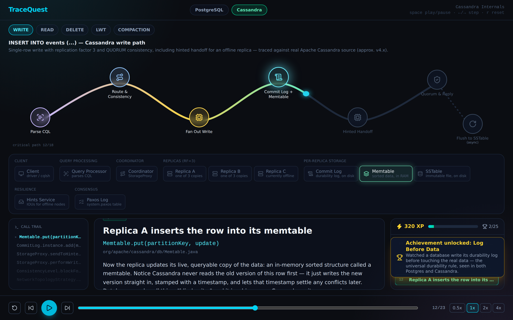

# TraceQuest

Watch real systems run, one source-level step at a time. TraceQuest is a browser-based simulator that walks through the exact internal execution path of database and distributed-systems operations — reproduced faithfully from real source code, with plain-English explanations for every step.

[](https://github.com/Diafyx/tracequest/actions/workflows/ci.yml)
[](LICENSE)
[](https://tracequest-d0m.pages.dev)

**Live demo:** https://tracequest-d0m.pages.dev



## Overview

Databases and distributed systems are usually black boxes: you send a query and get a result back, with no visibility into everything that happened in between. TraceQuest opens the box. Each operation is broken down into the real functions, files, and data structures involved — in the order they actually execute — and animated as a station-based journey you can play, pause, step through, and rewind.

Progress carries XP and achievements across every tool, so learning one system's internals feeds into recognizing the same patterns (write-ahead logging, replication, consistency models) in the next one.

## Tools

| Tool | Operations | What you see | Traced against |
|---|---|---|---|
| **PostgreSQL** | INSERT, indexed INSERT, SELECT, UPDATE, DELETE | MVCC visibility, WAL, heap pages, B-tree maintenance | PostgreSQL ~v16 |
| **Cassandra** | WRITE, READ, DELETE, lightweight transaction (LWT), compaction | Token routing, QUORUM consistency, commit log + memtable, hinted handoff, bloom filters, read repair, tombstones and `gc_grace_seconds`, Paxos, SSTable compaction | Apache Cassandra ~v4.x |

More tools and operations are added incrementally; each lives as a self-contained scenario, so the list above will grow.

## Screenshots

**PostgreSQL UPDATE:** Postgres never edits a row in place. It forms a new row version and marks the old one expired.



**Cassandra WRITE:** a QUORUM write with replication factor 3, reaching a replica's commit log and memtable.



## Keyboard shortcuts

| Key | Action |
|---|---|
| <kbd>Space</kbd> | Play or pause |
| <kbd>&rarr;</kbd> / <kbd>&larr;</kbd> | Step forward or back |
| <kbd>R</kbd> | Reset the current scenario |

## Tech Stack

- React + TypeScript, built with Vite
- Tailwind CSS for styling
- Zustand for state
- Framer Motion for animation
- Hand-built SVG journey-path visualization (no graph/diagramming library)
- Vitest for tests

## Getting Started

Requires Node.js 24 LTS (pinned in [`.nvmrc`](.nvmrc); 22.12+ also works).

```bash
git clone https://github.com/Diafyx/tracequest.git
cd tracequest
npm ci
npm run dev
```

## Scripts

| Command | Description |
|---|---|
| `npm run dev` | Start the local dev server with hot reload |
| `npm run build` | Type-check and produce a production build |
| `npm run typecheck` | Type-check only |
| `npm run lint` | Run oxlint |
| `npm test` | Run the test suite once |
| `npm run test:watch` | Run tests in watch mode |
| `npm run preview` | Preview the production build locally |

## Contributing

Issues and pull requests are welcome. Please read the [contributing guide](https://github.com/Diafyx/.github/blob/main/CONTRIBUTING.md) first, and open an issue before starting anything larger than a small fix.

To report a security vulnerability, follow the [security policy](https://github.com/Diafyx/.github/blob/main/SECURITY.md). Please do not open a public issue.

## License

[MIT](LICENSE) © Sepuri Sai Krishna
